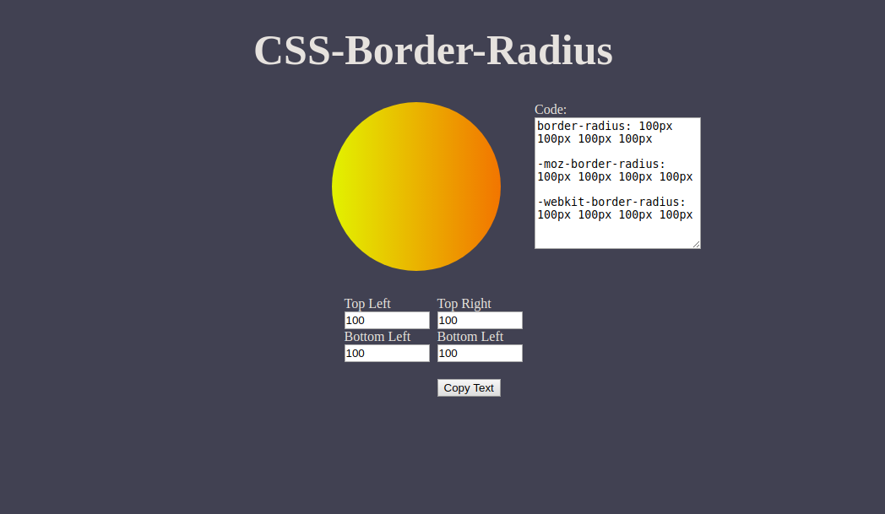

# CSS-border-viewer
A border viewer for CSS
With this application you can insert border values in the div and view in real time how these values shape it.
This application was created using CSS3, HTML5 and JS.

https://acsprudencio.github.io/CSS-border-viewer/
